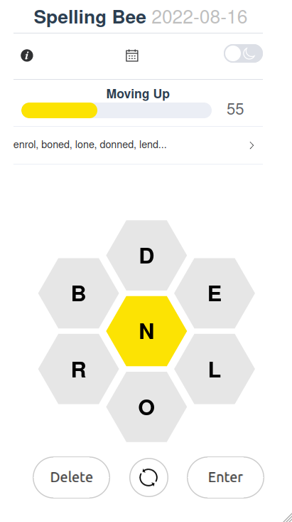
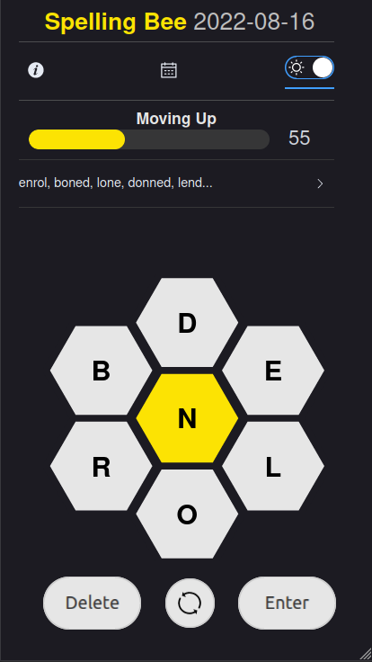

# Spelling Bee

An open source game inspired by the New York Times Spelling Bee Puzzle.
New challenge every day. Create words using letters from the hive.

## Links

https://spelling-b.netlify.app

|                                              |                                                  |
| -------------------------------------------- | ------------------------------------------------ |
|  |  |

## Credits

- Inspired by https://www.nytimes.com/puzzles/spelling-bee
- Using [12 dicts](http://wordlist.aspell.net/12dicts/) word list https://github.com/en-wl/wordlist/blob/master/alt12dicts/2of4brif.txt
- Using fireworks.scss https://codepen.io/hmaw/pen/qBEMLxV
- Using Element Plus UI https://github.com/element-plus/element-plus
- Favicon created using http://faviconer.com

## Development

See [dev.md](./dev.md)
